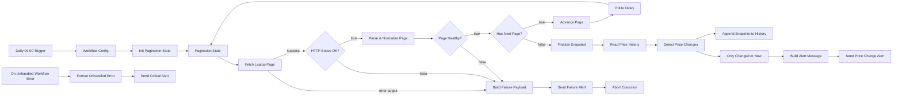

# Laptop Price Monitor – n8n Workflow Architecture

| Item | Value |
| --- | --- |
| Workflow file | `B-n8n/workflow.json` (n8n v1 export format, `executionOrder: v1`) |
| Target | `https://webscraper.io/test-sites/e-commerce/static/computers/laptops?page=N` |
| Schedule | Daily at 09:00, cron `0 9 * * *`, timezone `Europe/Istanbul` |
| Storage | Google Sheets, append-only `price_history` sheet |
| Notifications | Telegram (Markdown) for price changes, failures and unhandled errors |
| Node count | 24 functional nodes + 4 sticky notes |

## 1. Baseline Template

**Starting template:** [Competitor price monitoring with web scraping, Google Sheets & Telegram](https://n8n.io/workflows/4640-competitor-price-monitoring-with-web-scrapinggoogle-sheets-and-telegram/) (n8n.io template #4640, author `tonydatahut`).

The brief suggested `https://n8n.io/workflows/1884-web-scraper-and-email-notification/`, but that URL returns HTTP 404, and template ID 1884 is also missing from the public template API (`api.n8n.io/api/templates/workflows/1884`). Template #4640 was chosen instead because it is the closest real match in the official library to the requested "web scraper + Telegram/Email notification" pattern. It follows the same basic flow:

`Schedule Trigger -> Google Sheets (product list) -> Split In Batches -> Wait -> HTTP Request -> HTML Extract -> Code (normalize price) -> Code (compute change) -> IF (changed?) -> Google Sheets (history + master update) -> Telegram`

Its node type versions were kept so the export is compatible with current n8n releases: `scheduleTrigger 1.2`, `httpRequest 4.2`, `code 2`, `if 2.2`, `wait 1.1`, `googleSheets 4.5`, `telegram 1.2`.

## 2. Topology



## 3. Step-by-Step Data Pipeline

### 3.1 Trigger and configuration

- **Daily 09:00 Trigger** (`scheduleTrigger`) uses `rule.interval[].field = cronExpression` with `0 9 * * *`. The workflow-level `settings.timezone` is pinned to `Europe/Istanbul`, so the schedule does not depend on the server's timezone.
- **Workflow Config** (`set`) is the single place for operator-tunable values: `maxPages` (50), `requestDelaySeconds` (1), `priceAnomalyThresholdPct` (20), `telegramChatId`, `googleSheetId`, `historySheetName`. Downstream nodes read these values through `$('Workflow Config').first().json` instead of hard-coding them.

### 3.2 Pagination loop

- **Init Pagination State** (Code) creates the loop state: `page: 1`, `maxPages`, `pagesFetched: 0`, `runId` (= `$execution.id`), `runStartedAt` and an empty `products` accumulator.
- **Pagination State** (No-Op) is the loop entry point. Both the initial state and every advanced state pass through it, so downstream Code nodes can always read the current iteration's state via `$('Pagination State').first()`.
- **Fetch Laptop Page** (HTTP Request) requests `...laptops?page={{ $json.page }}` with:
  - `fullResponse: true` and `neverError: true`, so 4xx/5xx responses become data (`statusCode`) that the workflow can evaluate instead of raw exceptions;
  - `retryOnFail` with 3 tries and a 3 s back-off, which absorbs transient network errors;
  - `onError: continueErrorOutput`: DNS, TLS and timeout errors that remain after the retries leave through a dedicated second output;
  - a custom `User-Agent` and a 30 s timeout.
- **Has Next Page?** (IF) is the stop condition. The loop continues only when **both** of these hold:
  1. the page HTML contains a `rel="next"` pagination link (on the live site, page 20 renders the "next" control as disabled with no `rel="next"`);
  2. `page < maxPages`, a hard safety bound against infinite loops if the site's markup changes.
- **Advance Page** (Code) increments `page` and carries the accumulated products forward. **Polite Delay** (Wait, 1 s) throttles the loop before it returns to *Pagination State*.

This design matters because the site does **not** signal the end of pagination with an error: `?page=99` returns HTTP 200 with zero products. A loop that only watched status codes would never end cleanly. It would either spin until the bound or persist empty pages.

### 3.3 Extraction and float sanitization

**Parse & Normalize Page** (Code) parses each `.thumbnail` product card with dependency-free regular expressions. That works on n8n Cloud and in self-hosted task runners without needing `NODE_FUNCTION_ALLOW_EXTERNAL`.

| Field | Source | Normalization |
| --- | --- | --- |
| `title` | `a.title[title]` attribute (full name; the link text can be truncated) | HTML entities decoded, whitespace collapsed |
| `price` | `[itemprop=price]` (fallback: `.price`) | `"$416.99"` → strip all characters except `0-9 . , -` → remove thousands separators → `parseFloat` → rounded to 2 decimals → **`416.99` (Number)** |
| `review_count` | `[itemprop=reviewCount]` (fallback: `N reviews`) | `parseInt`, integer |
| `rating` | `[data-rating]` | `parseInt` |
| `url` | `a.title[href]` (relative) | Made absolute: `https://webscraper.io/test-sites/e-commerce/static/product/31` |
| `product_id` | numeric segment of `/product/{id}` | Stable key for diffing |
| `description`, `currency`, `page` | card text / constant `USD` / loop state | — |

Products are merged into the accumulator using `product_id` as the key, so a product that appears on two pages is not counted twice. The node outputs `status: "ok" | "error"`:

- `ZERO_PRODUCTS`: a page that pagination said should exist contained no parsable cards (layout change, bot wall, or empty page);
- `PARSE_FAILURE`: at least one card was missing its title, link or a price that parses as a number. Such a card is never silently dropped.

### 3.4 Storage

- **Finalize Snapshot** (Code) stamps every product with `run_id` and `scraped_at = $now.toISO()`, an ISO-8601 timestamp with the Istanbul offset. As a last guard, it refuses to continue with an empty snapshot.
- **Read Price History** (Google Sheets, `read`) loads the historical rows. It runs with `executeOnce` and `alwaysOutputData`, so an empty sheet on the first run still produces one empty item and the flow continues.
- **Append Snapshot to History** (Google Sheets, `append`, `autoMapInputData`) appends the full snapshot and its diff metadata. History is append-only (one row per product per run), which keeps a complete time series for trend analysis.

Required header row for the `price_history` sheet (same as the column schema embedded in the node):

```text
run_id | scraped_at | product_id | title | price | currency | review_count | rating | url | page | change_type | previous_price | price_delta | price_delta_pct | is_anomaly | is_baseline_run
```

> **Data Table alternative:** on n8n versions that include the built-in Data Tables feature, create a table with the same columns (`price`, `previous_price`, `price_delta`, `price_delta_pct` as Number; `is_anomaly`, `is_baseline_run` as Boolean; others as String). Then replace the two Google Sheets nodes with *Data Table → Get rows* and *Data Table → Insert row*. No other node needs to change.

### 3.5 Diff detection

**Detect Price Changes** (Code) builds a `product_id → latest price` map from the history rows, choosing the row with the highest `scraped_at`. Rows without an ID or with an unparsable price are ignored defensively. Each current product is then classified:

| `change_type` | Rule |
| --- | --- |
| `NEW` | Product ID never seen before |
| `PRICE_UP` / `PRICE_DOWN` | Price moved by at least $0.01 compared with the latest stored snapshot |
| `UNCHANGED` | Price moved by less than $0.01 |

The node also computes `previous_price`, `price_delta`, `price_delta_pct`, and `is_anomaly` (absolute percentage move ≥ `priceAnomalyThresholdPct`). `is_baseline_run` is `true` when the history is empty.

### 3.6 Notifications

- **Only Changed or New** (Filter) keeps rows where `change_type != UNCHANGED` **and** `is_baseline_run == false`. The first run therefore only seeds the history and does not send an alert for all ~117 products. If nothing changed, the filter emits no items and no message is sent.
- **Build Alert Message** (Code) combines all changes into **one** Telegram Markdown message, split into these sections: *ANOMALY* (sorted by size of the move), *Price drops*, *Price increases*, *New listings*. Each section is capped at 25 lines, and the message is truncated to Telegram's limit (4 000 characters). Titles are Markdown-escaped and link to the product page.
- **Send Price Change Alert** (Telegram, `parse_mode: Markdown`, link previews disabled).

Example output from the validation run:

```text
*Laptop Price Monitor - Change Report*
Run: `sim-1001` | 2026-09-28T11:45:04.858Z
Scanned: 117 products across 20 pages | Changes: 3

*ANOMALY - price moved beyond threshold (2)*
- [Aspire E1-510](https://webscraper.io/test-sites/e-commerce/static/product/32): $406.99 -> *$306.99* (-24.57%)
...
*Price increases (1)*
- [ThinkPad T540p](https://webscraper.io/test-sites/e-commerce/static/product/33): $1177.99 -> *$1178.99* (+0.08%)
```

## 4. Defensive Error Branching

| Failure mode | Detected by | Route |
| --- | --- | --- |
| DNS / TLS / timeout / connection reset (after 3 retries) | HTTP node error output (`continueErrorOutput`) | Build Failure Payload (`HTTP_TRANSPORT`) |
| HTTP 4xx / 5xx | **HTTP Status OK?** (`200 ≤ statusCode < 300`) | Build Failure Payload (`HTTP_STATUS`) |
| Zero products on a page too early, or unparsable price cards | **Page Healthy?** (`status == ok`) | Build Failure Payload (`EXTRACTION`) |
| Anything else (Sheets quota/auth, Telegram outage, code exception) | **On Unhandled Workflow Error** (Error Trigger) | Format Unhandled Error → Send Critical Alert |

The controlled branch works as follows:

1. **Build Failure Payload** records the stage, page, URL, number of pages already completed, run ID and error detail.
2. **Send Failure Alert** sends a Telegram message. It is set to `onError: continueRegularOutput`, so an outage of the alerting channel cannot stop the abort step.
3. **Abort Execution** (Stop and Error) fails the execution on purpose. Nothing is written to the history sheet, so a partial or corrupted scrape can never become the baseline for the next diff. The execution also shows as *failed* in the n8n UI instead of passing silently.

The global Error Trigger is a safety net for nodes outside the controlled branch. To activate it, open the imported workflow and set **Settings → Error Workflow → this workflow**. A workflow's own ID only exists after import, so this setting cannot be included in the JSON. *Format Unhandled Error* ignores errors raised by *Abort Execution*, so each controlled failure produces exactly one alert.

## 5. Modifications to the Baseline Template

| Area | Baseline (#4640) | This workflow |
| --- | --- | --- |
| Input discovery | Fixed list of product URLs read from a sheet; one HTTP call per row | Crawls a **paginated catalogue**: stateful `?page=N` loop, stop condition based on `rel="next"`, `maxPages` hard bound, accumulator deduplicated by `product_id` |
| Price parsing | `parseFloat(str.replace(/[^0-9.]+/g, ""))` with no validation; `NaN` flows downstream | Currency and thousands separators stripped, 2-decimal rounding, `null` on failure. Any unparsable card fails the whole page (`PARSE_FAILURE`) instead of storing `NaN` |
| HTTP errors | Default behaviour: a 4xx/5xx or timeout throws, and the run dies with no alert | Retries, `neverError` + status-code gate, transport-error output, Telegram alert, then explicit abort |
| Empty results | Not detected; an empty selector is treated as a price of `NaN` | `ZERO_PRODUCTS` check per page, plus an empty-snapshot guard before persistence |
| History model | Overwrites `last_price` in a master sheet and logs history separately | One append-only time series; the previous price comes from the latest row per product, so there is a single source of truth |
| Change semantics | Boolean `price_changed` | `NEW` / `PRICE_UP` / `PRICE_DOWN` / `UNCHANGED`, plus delta, percentage and `is_anomaly` threshold |
| Alerts | One Telegram message per changed product | One grouped, Markdown-escaped digest per run; suppressed on the baseline run |
| Configuration | Chat ID and sheet IDs hard-coded in several nodes | Centralized in **Workflow Config** |
| Observability | None | Global Error Trigger branch that avoids duplicate alerts; `runId` carried through every message |

## 6. Setup

1. In n8n, open **Workflows → Import from File** and select `B-n8n/workflow.json`.
2. In **Workflow Config**, set `telegramChatId` and `googleSheetId` (the ID segment of the spreadsheet URL).
3. Create the `price_history` sheet with the header row from §3.4.
4. Attach credentials: *Google Sheets OAuth2* on **Read Price History** and **Append Snapshot to History**; *Telegram Bot API* on the three Telegram nodes. In **Send Critical Alert**, also replace the chat ID literal, because an Error Trigger execution cannot read *Workflow Config*.
5. Set **Settings → Error Workflow** to this workflow, then activate it.

## 7. Validation

`workflow.json` is generated from reviewable sources and checked automatically:

```powershell
.\.venv\Scripts\python.exe B-n8n\build_workflow.py      # embeds B-n8n/code/*.js into workflow.json
.\.venv\Scripts\python.exe B-n8n\validate_workflow.py   # add --offline to skip the Node.js checks and live site checks
```

`validate_workflow.py` runs 48 checks:

- **JSON and graph integrity:** unique node names and IDs, no dangling connections, every node reachable from a trigger.
- **Mandatory nodes:** checks that each required node type is present.
- **Configuration:** cron expression, timezone, paginated URL, loop cycle, stop condition, float parsing, retry and error-output settings, failure routing, append schema, `$now` timestamping.
- **Code nodes:** `node --check` on every Code node.
- **Live simulation:** `tests/simulate_pipeline.js` runs the Code-node JavaScript embedded in `workflow.json` against the live site and asserts that:
  - all 20 pages and 117 products are scraped;
  - `"$416.99"` becomes `416.99` as a Number;
  - URLs are absolute;
  - the diff classification is correct, including malformed history rows;
  - the alert message is under Telegram's length limit;
  - the page-99 zero-product case routes to `EXTRACTION`;
  - duplicate alerts are suppressed.

## 8. Future Production Considerations

- **Rate limiting and politeness:** increase `requestDelaySeconds` for real retailers, honour `robots.txt` and `Retry-After` on HTTP 429/503 (for example with an extra IF node that routes 429 to a longer Wait before retrying), and spread schedules across targets.
- **Proxies and anti-bot measures:** route the HTTP node through a rotating residential or datacenter proxy (HTTP Request → *Proxy* option) or a scraping API (Bright Data, ScrapingBee, Decodo). Rotate User-Agent strings, and treat CAPTCHA or interstitial pages as `ZERO_PRODUCTS` failures, which the workflow already does.
- **JS-rendered sites:** this target is server-rendered. For SPA catalogues (such as the `/ajax/` and `/scroll/` variants of the same test site), replace the HTTP node with a headless browser (Browserless/Puppeteer community node, Playwright microservice, or Firecrawl), or call the site's underlying JSON XHR endpoint directly. Everything from the pagination state onward can stay as it is.
- **Selector drift:** move the selectors into *Workflow Config* or use the HTML node's CSS extraction. Keep the `PARSE_FAILURE` / `ZERO_PRODUCTS` guards so that markup changes are reported instead of producing empty data.
- **Storage scale:** Google Sheets slows down past a few hundred thousand cells. Move history to Postgres, BigQuery or n8n Data Tables with an index on `(product_id, scraped_at)`, and query only the latest row per product instead of reading the full history.
- **Removed listings:** products that are in the latest snapshot but missing from the current run could be reported as `REMOVED`. This needs a separate branch, because such rows have no current price to append.
- **Concurrency and idempotency:** keep a single active schedule, or use a lock row keyed by date, so overlapping manual and scheduled runs cannot double-append the same day.
- **Secrets and multi-channel alerts:** keep chat IDs and sheet IDs in n8n Variables or environment variables where the plan allows. Add Email or Slack nodes in parallel to Telegram on the same `text` payload for redundancy.
